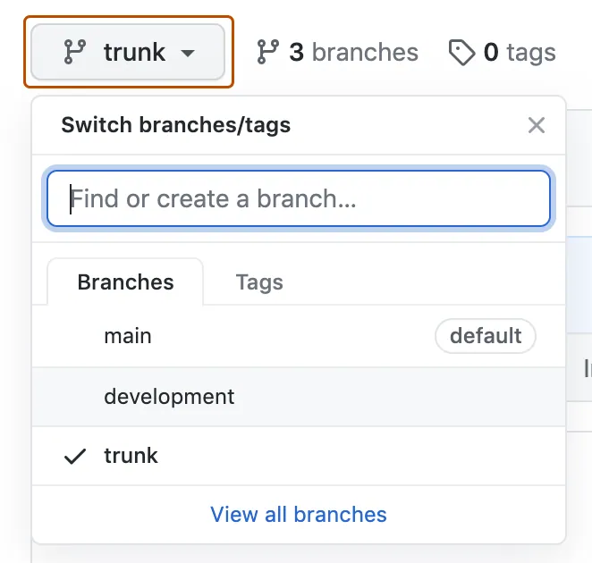
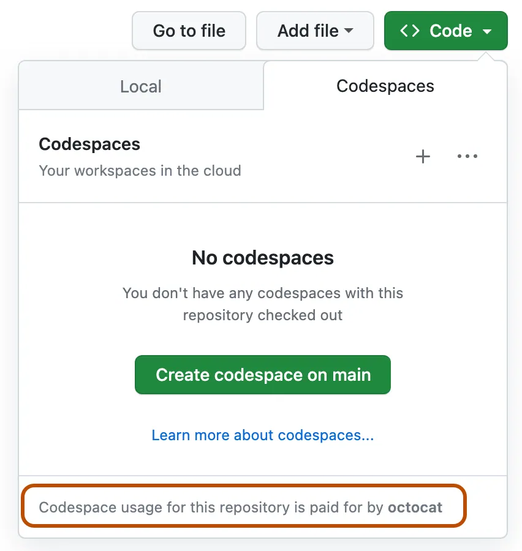
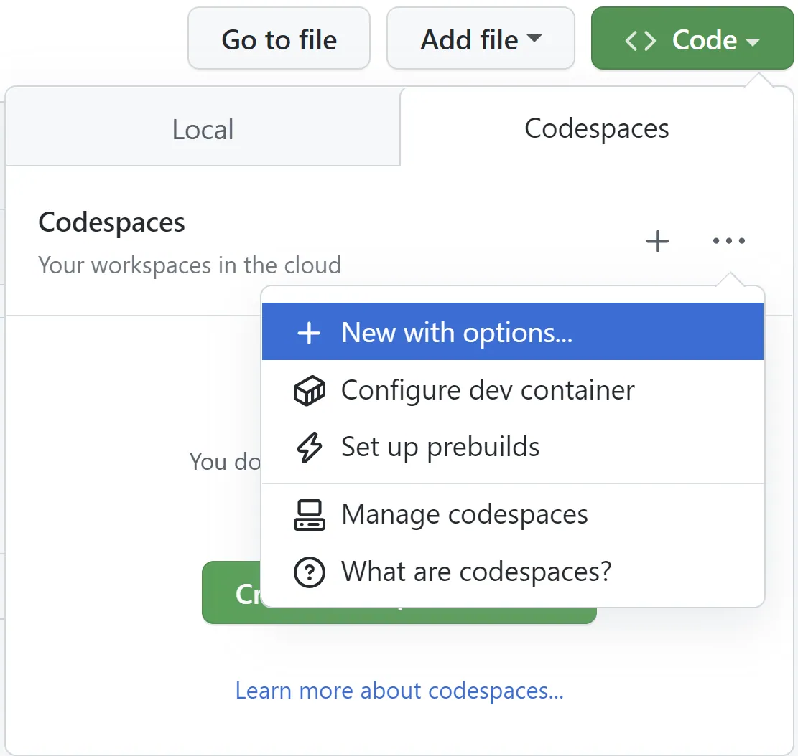
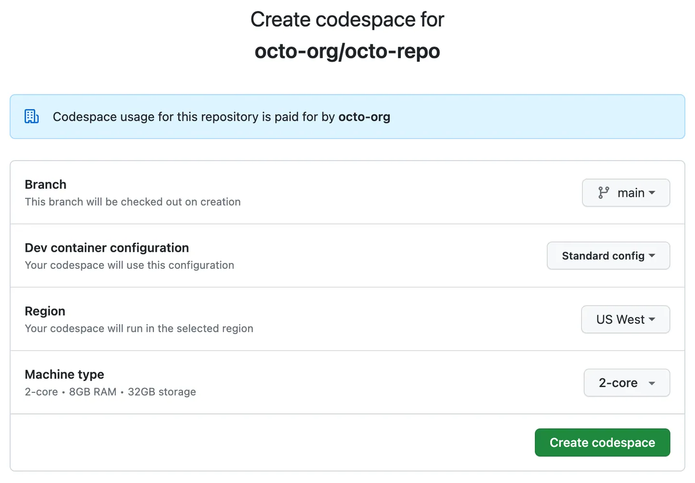
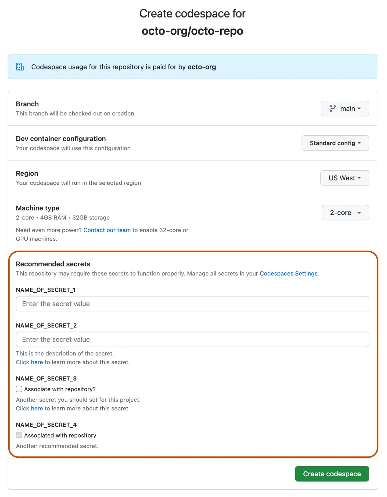

# Como criar um codespace para um repositório

Você pode criar um codespace para uma branch em um repositório para fazer o desenvolvimento on-line.

## Sobre como criar um codespace para um repositório

Você pode criar um codespace no GitHub, no Visual Studio Code, ou usando a GitHub CLI. Use as guias neste artigo para ver instruções de cada uma dessas maneiras de criar um codespace.

Você pode usar GitHub Codespaces em sua conta pessoal do GitHub, com a cota de uso gratuito incluída a cada mês para contas nos planos Gratuito e Pro. Você pode continuar usando GitHub Codespaces além do armazenamento e uso de computação incluídos mensalmente fornecendo detalhes de pagamento e definindo um limite de gastos. Confira [Cobrança do GitHub Codespaces](/pt/billing/concepts/product-billing/github-codespaces).

As organizações podem permitir que membros e colaboradores externos criem e usem codespaces às custas da organização. Para saber mais, confira [Como escolher quem tem a propriedade e paga pelos codespaces em sua organização](/pt/codespaces/managing-codespaces-for-your-organization/choosing-who-owns-and-pays-for-codespaces-in-your-organization).

A capacidade de criar codespaces com base em repositórios de propriedade da organização depende de vários fatores, como a visibilidade do repositório e as configurações da organização ou da empresa-mãe. Para saber mais, confira [Solucionar problemas de criação e exclusão de codespaces](/pt/codespaces/troubleshooting/troubleshooting-creation-and-deletion-of-codespaces#no-access-to-create-a-codespace).

Ao iniciar um novo projeto, você pode criar um codespace com base em um modelo e publicá-lo mais tarde em um repositório no GitHub. Para saber mais, consulte [Como criar um codespace com base em um modelo](/pt/codespaces/developing-in-a-codespace/creating-a-codespace-from-a-template).

Se você criar um codespace com base em um repositório, o codespace será associado a um branch específico, que não poderá estar vazio. Você pode criar mais de um código de espaço por repositório ou até mesmo por branch.

Você poderá ver todos os codespaces disponíveis que criou na página "Seus codespaces". Para exibir essa página, no canto superior esquerdo do GitHub, selecione <svg version="1.1" width="16" height="16" viewBox="0 0 16 16" class="octicon octicon-three-bars" aria-label="Open global navigation menu" role="img"><path d="M1 2.75A.75.75 0 0 1 1.75 2h12.5a.75.75 0 0 1 0 1.5H1.75A.75.75 0 0 1 1 2.75Zm0 5A.75.75 0 0 1 1.75 7h12.5a.75.75 0 0 1 0 1.5H1.75A.75.75 0 0 1 1 7.75ZM1.75 12h12.5a.75.75 0 0 1 0 1.5H1.75a.75.75 0 0 1 0-1.5Z"></path></svg> e clique **<svg version="1.1" width="16" height="16" viewBox="0 0 16 16" class="octicon octicon-codespaces" aria-label="codespaces" role="img"><path d="M0 11.25c0-.966.784-1.75 1.75-1.75h12.5c.966 0 1.75.784 1.75 1.75v3A1.75 1.75 0 0 1 14.25 16H1.75A1.75 1.75 0 0 1 0 14.25Zm2-9.5C2 .784 2.784 0 3.75 0h8.5C13.216 0 14 .784 14 1.75v5a1.75 1.75 0 0 1-1.75 1.75h-8.5A1.75 1.75 0 0 1 2 6.75Zm1.75-.25a.25.25 0 0 0-.25.25v5c0 .138.112.25.25.25h8.5a.25.25 0 0 0 .25-.25v-5a.25.25 0 0 0-.25-.25Zm-2 9.5a.25.25 0 0 0-.25.25v3c0 .138.112.25.25.25h12.5a.25.25 0 0 0 .25-.25v-3a.25.25 0 0 0-.25-.25Z"></path><path d="M7 12.75a.75.75 0 0 1 .75-.75h4.5a.75.75 0 0 1 0 1.5h-4.5a.75.75 0 0 1-.75-.75Zm-4 0a.75.75 0 0 1 .75-.75h.5a.75.75 0 0 1 0 1.5h-.5a.75.75 0 0 1-.75-.75Z"></path></svg> Codespaces**. Isso leva você para [github.com/codespaces](https://github.com/codespaces).

### O processo de criação do codespace

Ao criar um codespace, várias etapas acontecem para criar e conectar você ao seu ambiente de desenvolvimento:

- Etapa 1: A VM e o armazenamento são atribuídos ao seu codespace.
- Etapa 2: O contêiner é criado e seu repositório é clonado.
- Passo 3: Você pode conectar-se ao codespace.
- Etapa 4: O codespace continua com a configuração pós-criação.

Para saber mais sobre o que acontece quando você cria um codespace, confira [Aprofundamento de GitHub Codespaces](/pt/codespaces/about-codespaces/deep-dive).

Para saber mais sobre o ciclo de vida de um codespace, confira [Noções básicas sobre o ciclo de vida do codespace](/pt/codespaces/about-codespaces/understanding-the-codespace-lifecycle).

Caso deseje usar ganchos do Git para o codespace, configure os ganchos usando os scripts de ciclo de vida `devcontainer.json`, como `postCreateCommand`. Eles são executados durante a etapa 4, acima. Para obter informações sobre os scripts de ciclo de vida, confira a [especificação de contêineres de desenvolvimento](https://containers.dev/implementors/json_reference/#lifecycle-scripts) no site de contêineres de desenvolvimento. Como o contêiner de desenvolvimento para o seu codespace é criado depois que o repositório é clonado, qualquer [diretório de modelo do Git](https://git-scm.com/docs/git-init#_template_directory) configurado na imagem de contêiner de desenvolvedor não se aplicará ao seu codespace. Os Hooks devem ser instalados depois que o codespace for criado.

Você pode editar código, depurar e usar comandos do Git ao mesmo tempo que faz o desenvolvimento em um codespace com VS Code. Para obter mais informações, confira a [documentação do VS Code](https://code.visualstudio.com/docs).

Para acelerar a criação de codespaces, os administradores de repositório podem habilitar pré-builds do GitHub Codespaces em um repositório. Para saber mais, confira [Sobre as pré-compilações do GitHub Codespaces](/pt/codespaces/prebuilding-your-codespaces/about-github-codespaces-prebuilds).

## Como criar um codespace para um repositório

1. Em GitHub, acesse a página principal do repositório.

2. No nome do repositório, selecione o menu suspenso do branch, que é rotulado com o nome do branch atual e clique no branch para o qual você deseja criar um codespace.

   

3. Clique no botão **<svg version="1.1" width="16" height="16" viewBox="0 0 16 16" class="octicon octicon-code" aria-label="code" role="img"><path d="m11.28 3.22 4.25 4.25a.75.75 0 0 1 0 1.06l-4.25 4.25a.749.749 0 0 1-1.275-.326.749.749 0 0 1 .215-.734L13.94 8l-3.72-3.72a.749.749 0 0 1 .326-1.275.749.749 0 0 1 .734.215Zm-6.56 0a.751.751 0 0 1 1.042.018.751.751 0 0 1 .018 1.042L2.06 8l3.72 3.72a.749.749 0 0 1-.326 1.275.749.749 0 0 1-.734-.215L.47 8.53a.75.75 0 0 1 0-1.06Z"></path></svg> Code** e na guia **Codespaces**.

   Uma mensagem é exibida na parte inferior da caixa de diálogo informando quem pagará pelo codespace.

   

4. Crie seu codespace, usando as opções padrão ou depois de configurar opções avançadas:
   - **Usar as opções padrão**

     Para criar um codespace usando as opções padrão, clique em <svg version="1.1" width="16" height="16" viewBox="0 0 16 16" class="octicon octicon-plus" aria-label="Create a codespace on BRANCH" role="img"><path d="M7.75 2a.75.75 0 0 1 .75.75V7h4.25a.75.75 0 0 1 0 1.5H8.5v4.25a.75.75 0 0 1-1.5 0V8.5H2.75a.75.75 0 0 1 0-1.5H7V2.75A.75.75 0 0 1 7.75 2Z"></path></svg>.   

   - **Configurar opções avançadas**

     Para configurar opções avançadas para seu codespace, como um tipo de computador diferente ou um arquivo específico `devcontainer.json`:
     1. No canto superior direito da guia **Codespaces**, selecione <svg version="1.1" width="16" height="16" viewBox="0 0 16 16" class="octicon octicon-kebab-horizontal" aria-label="Codespace repository configuration" role="img"><path d="M8 9a1.5 1.5 0 1 0 0-3 1.5 1.5 0 0 0 0 3ZM1.5 9a1.5 1.5 0 1 0 0-3 1.5 1.5 0 0 0 0 3Zm13 0a1.5 1.5 0 1 0 0-3 1.5 1.5 0 0 0 0 3Z"></path></svg> e clique em **Novo com opções**.

1. Na página de opções do codespace, escolha as opções da sua preferência nos menus suspensos.

A página de opções também pode exibir os nomes de um ou mais segredos que recomendamos que você crie nas configurações do Codespaces. Para obter mais informações, consulte [Segredos recomendados](#recommended-secrets).

> \[!NOTE]
>
> - Você pode adicionar a página de opções aos favoritos para obter uma forma rápida de criar um codespace para esse repositório e esse branch.
> - A página <https://github.com/codespaces/new> fornece uma forma rápida de criar um codespace para qualquer repositório e ramificação. Você pode acessar essa página rapidamente digitando `codespace.new` na barra de endereços do navegador.
> - Para obter mais informações sobre os arquivos de configuração do contêiner de desenvolvimento, consulte [Introdução aos contêineres de desenvolvimento](/pt/codespaces/setting-up-your-project-for-codespaces/adding-a-dev-container-configuration/introduction-to-dev-containers).
> - Para saber mais sobre os tipos de máquina, consulte [Alterando o tipo de máquina para seu codespace](/pt/codespaces/customizing-your-codespace/changing-the-machine-type-for-your-codespace#about-machine-types).
> - Sua escolha de tipos de computador disponíveis pode ser limitada por vários fatores. Esses fatores podem incluir uma política configurada para a organização ou uma especificação mínima de tipo de computador para o repositório. Para saber mais, confira [Restringindo o acesso aos tipos de máquina](/pt/codespaces/managing-codespaces-for-your-organization/restricting-access-to-machine-types) e [Definindo uma especificação mínima para máquinas de codespaces](/pt/codespaces/setting-up-your-project-for-codespaces/configuring-dev-containers/setting-a-minimum-specification-for-codespace-machines).

2. Clique em **Criar codespace**.

## Segredos recomendados

Os nomes de segredos definidos pelo usuário podem ser exibidos na página de opções avançadas quando você cria um codespace. Isso acontecerá se os segredos recomendados tiverem sido especificados na configuração de contêiner de desenvolvimento selecionada. Para saber mais, confira [Como especificar segredos recomendados para um repositório](/pt/codespaces/setting-up-your-project-for-codespaces/configuring-dev-containers/specifying-recommended-secrets-for-a-repository).

Recomenda-se inserir valores para esses segredos de ambiente de desenvolvimento, quando você receber uma solicitação para fazer isso, porque é provável que o projeto vá precisar de valores para esses segredos. No entanto, o fornecimento de valores não é necessário para que você crie um codespace. Você poderá definir esses segredos no codespace, se preferir.

Se você inserir um valor para um segredo recomendado, o segredo estará disponível no novo codespace. Quando você clica em **Criar codespace**, o segredo também é adicionado às suas configurações pessoais do Codespaces, ou seja, você não precisará inserir um valor para o segredo no futuro ao criar um codespace para esse repositório.

Se o nome de um segredo for mostrado com uma caixa de seleção indisponível para seleção e nenhuma caixa de entrada, isso ocorrerá porque você já tem um segredo desse nome definido nas configurações pessoais do Codespaces, e você o associou a esse repositório. Se você criar um segredo desse nome, mas não o associar a esse repositório, a caixa de seleção estará disponível para seleção e, ao fazer isso, você poderá atualizar suas configurações para adicionar a associação.

Caso deseje alterar o valor de um segredo previamente selecionado, faça isso nas suas configurações pessoais do Codespaces em [github.com/settings/codespaces](https://github.com/settings/codespaces). Para saber mais, confira [Gerenciando seus segredos específicos da conta no GitHub Codespaces](/pt/codespaces/managing-your-codespaces/managing-your-account-specific-secrets-for-github-codespaces).

## Leitura adicional

- [Como abrir um codespace existente](/pt/codespaces/developing-in-a-codespace/opening-an-existing-codespace)
- [Como facilitar a criação rápida e a retomada de codespaces](/pt/codespaces/setting-up-your-project-for-codespaces/setting-up-your-repository/facilitating-quick-creation-and-resumption-of-codespaces)
- [Pontos de acesso da API REST para organizações Codespaces](/pt/rest/codespaces/organizations)
